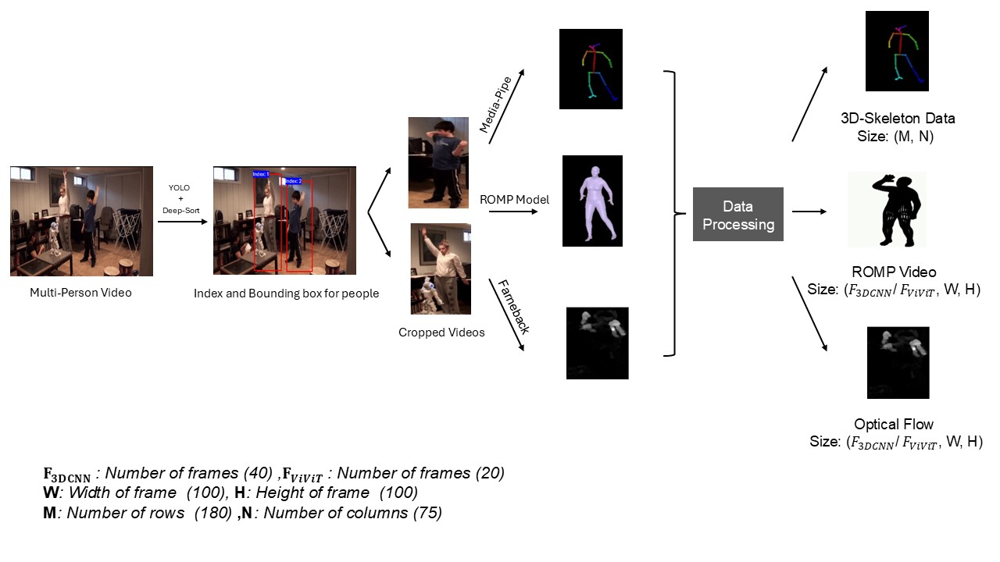
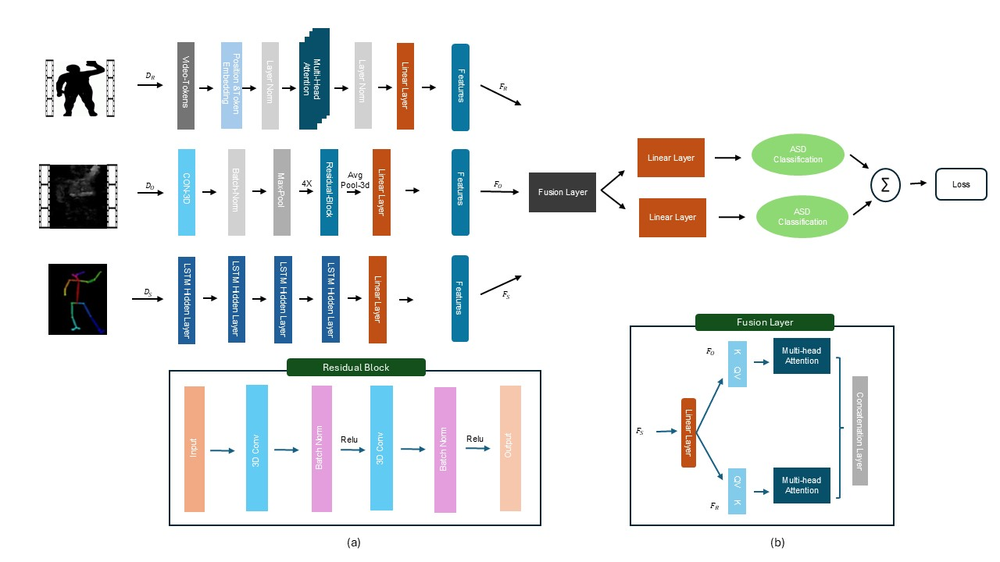

# MMASD+: A Novel Dataset for Privacy-Preserving Behavior Analysis of Children with Autism Spectrum Disorder

This is the repository for **MMASD+**, an enhanced version of the original MMASD dataset. MMASD+ is a groundbreaking dataset and framework designed for the privacy-preserving analysis of behaviors in children with Autism Spectrum Disorder (ASD) during play therapy sessions. Unlike the original MMASD dataset, which lacked the ability to distinguish between therapists and children, MMASD+ addresses this limitation by providing clearer labeling and improved privacy measures, making it ideal for analyzing behaviors in children with ASD.

## Dataset Overview

The MMASD+ dataset offers three types of data:
- **3D Skeleton Data:**  Joint coordinates captured in 3D space using the MediaPipe framework.
- **3D Body Mesh Data:** Detailed 3D body mesh reconstructions using the Regression of Multiple People (ROMP) method.
- **Optical Flow Data:** Motion information derived from video sequences using the Farneback algorithm.
  
The MMASD+ dataset covers a diverse array of 11 human actions. A detailed list of these action types, along with the number of distinct videos for each, is provided in Table 1.

| S.NO | Action Class             | No. Videos |
|:----:|:-------------------------|-----------:|
| 1    | Arm Swing                | 105        |
| 2    | Body Swing               | 119        |
| 3    | Chest Expansion          | 114        |
| 4    | Drumming                 | 168        |
| 5    | Sing and Clap            | 113        |
| 6    | Twist Pose               | 120        |
| 7    | Tree Pose                | 129        |
| 8    | Frog Pose                | 113        |
| 9    | Squat Pose               | 101        |
| 10   | Maracas Forward Shaking  | 103        |
| 11   | Maracas Shaking          | 130        |

<table>
  <tr>
    <th style="background-color: #4CAF50; color: white;">S.NO</th>
    <th style="background-color: #4CAF50; color: white;">Action Class</th>
    <th style="background-color: #4CAF50; color: white;">No. Videos</th>
  </tr>
  <tr><td>1</td><td>Arm Swing</td><td>105</td></tr>
  <tr><td>2</td><td>Body Swing</td><td>119</td></tr>
  <tr><td>3</td><td>Chest Expansion</td><td>114</td></tr>
  <tr><td>4</td><td>Drumming</td><td>168</td></tr>
  <tr><td>5</td><td>Sing and Clap</td><td>113</td></tr>
  <tr><td>6</td><td>Twist Pose</td><td>120</td></tr>
  <tr><td>7</td><td>Tree Pose</td><td>129</td></tr>
  <tr><td>8</td><td>Frog Pose</td><td>113</td></tr>
  <tr><td>9</td><td>Squat Pose</td><td>101</td></tr>
  <tr><td>10</td><td>Maracas Forward Shaking</td><td>103</td></tr>
  <tr><td>11</td><td>Maracas Shaking</td><td>130</td></tr>
</table>

**Table 1:** The different actions performed during therapy sessions along with the number of videos available for each action class.

# Privacy Features Exraction:
Before extracting privacy features, the raw video recordings undergo several pre-processing steps. First, individual persons are isolated from the video using a combination of YOLOv8 and Deep SORT algorithms. Subsequently, privacy features for each person, which preserve the essential movement characteristics, are extracted. The detailed steps of this feature extraction process are illustrated in Figure 1.

  

  
<strong>Figure 1:</strong> Flowchart of Data Processing

# Multimodal Tranformer Framework

To assess the effectiveness of the MMASD+ dataset, we evaluated it on two independent tasks: action classification and ASD identification. For these tasks, we tested various combinations of datasets and frameworks, as outlined in Table 2. The results for both action classification and ASD identification are presented in Table 3.

| S.NO | Data Combination         | Name | ML Frameworks           |
|------|--------------------------|------|-------------------------|
| 1    | SCD                      | A1   | LSTM                    |
| 2    | RVD                      | A2   | CNN, ViViT              |
| 3    | OFD                      | A3   | CNN, ViViT              |
| 4    | SCD + RV                 | A4   | LSTM + CNN              |
| 5    | SCD + OF                 | A5   | LSTM + CNN              |
| 6    | RVD + OFD                | A6   | CNN + CNN, ViViT + CNN  |
| 7    | SCD + RVD + OFD          | A7   | LSTM + CNN + CNN, LSTM + ViViT + CNN |

**Table 2:** Data Modalities and ML Frameworks

**Notes:**
- **SCD**: 3D Skeleton Coordinate Data
- **RVD**: ROMP Video Data
- **OFD**: Optical Flow Data

| S.No | Data-Model Combination | Action Classification Accuracy | Action Classification F1 | ASD Classification Accuracy | ASD Classification F1 |
|------|------------------------|-------------------------------|--------------------------|-----------------------------|------------------------|
| 1    | **A1**: SCD → LSTM                       | 0.8237 | 0.81   | 0.8872 | 0.8870 |
| 2    | **A2**: RVD → 3D-CNN                     | 0.8247 | 0.8245 | 0.8709 | 0.8707 |
| 3    | **A2**: RVD → ViViT                      | 0.8976 | 0.8836 | 0.9431 | 0.93   |
| 4    | **A3**: OFD → 3D-CNN                     | 0.86   | 0.8558 | 0.9271 | 0.9269 |
| 5    | **A3**: OFD → ViViT                      | 0.9024 | 0.8924 | 0.9340 | 0.94   |
| 6    | **A4**: SCD → LSTM, RVD → CNN            | 0.937  | 0.94   | 0.9434 | 0.9431 |
| 7    | **A5**: SCD → LSTM, OFD → 3D-CNN         | 0.9678 | 0.956  | 0.9487 | 0.9484 |
| 8    | **A6**: RVD → 3D-CNN, OFD → CNN          | 0.9671 | 0.96   | 0.9210 | 0.9220 |
| 9    | **A6**: RVD → ViViT, OFD → CNN           | 0.9689 | 0.9687 | 0.9502 | 0.9511 |
| 10   | **A6**: RVD → 3D-CNN, OFD → ViViT        | 0.9505 | 0.9502 | 0.9189 | 0.9185 |
| 11   | **A7**: RVD → ViViT, OFD → 3D-CNN, SCD → LSTM | **0.968** | **0.97** | **0.9531** | **0.9523** |
| 12   | **A7**: RVD → 3D-CNN, OFD → ViViT, SCD → LSTM | 0.9564 | 0.95   | 0.9364 | 0.9362 |

**Table 3:** Action Classification and ASD identification Results of Various Data-Model Combinations

From Table 3, we observed that the framework RVD → ViViT, OFD → CNN, SCD → LSTM achieved higher accuracy values for both tasks. Consequently, we employed this framework to perform action classification and ASD classification simultaneously within the same combination. Figure 2 illustrates the detailed architecture of the Multimodal Transformer Framework, which demonstrated performance exceeding 95% accuracy for both tasks. This highlights the robustness of the multimodal framework, along with the strength of the privacy-preserving dataset in capturing subtle body movement information.

  

  
<strong>Figure 2:</strong> Multimodal Transformer Framework

# Code and Data

The complete code for each data-model combination is available in the code folder, and a dataset is provided in the data folder.

The data folder is organized into three subfolders:

1. 3D-Skeleton: Includes 3D joint coordinates in CSV format. Each row represents a frame, and each column corresponds to a joint.
2. ROMP: Contains 3D body mesh coordinates stored in .npy files.
3. Optical Flow: Contains dense optical flow data.

# References

- **MMASD:** [MMASD GitHub Repository](https://github.com/Li-Jicheng/MMASD-A-Multimodal-Dataset-for-Autism-Intervention-Analysis/tree/main?tab=readme-ov-file)
- **MediaPipe:** [MediaPipe GitHub Repository](https://github.com/google/mediapipe)
- **ROMP:** [ROMP GitHub Repository](https://github.com/Arthur151/ROMP)
- **Farneback:** [OpenCV Farneback Optical Flow Documentation](https://docs.opencv.org/3.4/d4/dee/tutorial_optical_flow.html)

